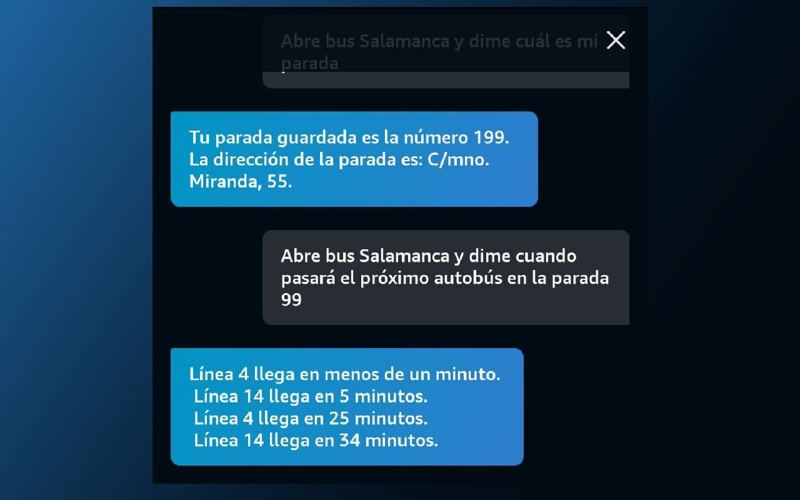

# Bus Salamanca Alexa

[](https://github.com/JuanmanDev/BusSalamancaAlexa/actions/workflows/docker-publish.yml)

Skill for Alexa to get bus arrival times in Salamanca.

## 🚀 New Dockerized Version

This project has been refactored to run as a standalone Docker service, removing the AWS Lambda dependency.

### Features
- **Docker Ready**: Lightweight image based on Alpine Node.
- **SQLite**: Local storage for favorite stops.
- **Express Server**: Official Alexa SDK Adapter for Express.
- **CI/CD**: Automatic image publishing to GitHub Container Registry (GHCR).

### Quick Deployment (Docker Compose)

1. Create a `docker-compose.yml` file:
   ```yaml
   services:
     bus-salamanca:
       image: ghcr.io/juanmandev/bussalamancaalexa:latest
       ports:
         - "3000:3000"
       environment:
         - VERIFY_SIGNATURE=true
       volumes:
         - ./data:/data
   ```
2. Run `docker-compose up -d`.
3. Configure your endpoint in the Alexa Console pointing to your server (HTTPS required).

For more details, see [DEPLOY.md](DEPLOY.md).

## Local Development

```bash
# Install dependencies
npm install

# Run in dev mode (with auto-reload)
npm run dev

# Run local verification tests
npm run test:local
```

### Environment Variables
Check `.env.example` to see available variables.

---
**Note**: Legacy AWS Lambda deployment has been temporarily disabled.

## ⚠️ Disclaimer

This project is **not affiliated** with "Salamanca de Transportes" company or the City Council of Salamanca. It's an independent project that uses publicly available data to provide a service to bus users.

## 🏗️ Architecture

The project follows this architecture:

```
┌───────────────┐      ┌────────────────┐      ┌───────────────┐      ┌────────────────┐
│               │      │                │      │               │      │                │
│  Alexa Device │─────▶│  Alexa Cloud   │─────▶│  AWS Lambda   │─────▶│ External SIRI  │
│               │      │     (AWS)      │      │  (This Code)  │      │  Web Service   │
│               │◀─────│                │◀─────│   +UI Data    │◀─────│                │
└───────────────┘      └────────────────┘      └───────────────┘      └────────────────┘
        ▲                                                                     │
        │                                                                     │
        └─────────────────────────────────────────────────────────────────────┘
                                     Response Flow
```

## 🔧 Technical Details

- Built with TypeScript and Node.js
- Deployed as an AWS Lambda function
- Uses the SIRI (Service Interface for Real Time Information) API to get bus data
- Implements the Alexa Skills Kit for voice interaction

## 🚀 CI/CD Pipeline

This project uses GitHub Actions for continuous integration and deployment:


The CI/CD pipeline automatically:
1. Runs tests when code is pushed to the main branch
2. Builds the TypeScript code
3. Deploys the code to AWS Lambda
4. Updates the Alexa skill

The workflow configuration is located in `.github/workflows/deploy-lambda.yml`.

## 🛠️ Development Setup

1. Clone the repository:
   ```bash
   git clone https://github.com/yourusername/BusSalamancaAlexa.git
   cd BusSalamancaAlexa
   ```

2. Install dependencies:
   ```bash
   npm install
   ```

3. Generate SIRI API types (this is not required as it is improved by fetch file):
   ```bash
   # Download WSDL if you haven't already
   # The WSDL file is already included in the repository as SiriWS.xml
   
   # Generate TypeScript types from WSDL
   npx wsdl-tsclient ./SiriWS.xml -o ./generated/
   ```

4. Build the project:
   ```bash
   npm run build
   ```

## 🧪 Testing

### Test the frontend interface

You can test the data received by running:

```bash
npx ts-node src/fe.ts
```

This will start a local server that simulates the Alexa frontend interaction.

### Test with Alexa Simulator

You can also test the skill using the Alexa Developer Console simulator.

## 📦 Deployment

The project is automatically deployed through GitHub Actions. If you want to manually deploy:

1. Build the project:
   ```bash
   npm run build
   ```

2. Deploy to AWS Lambda:
   ```bash
   # Using AWS CLI
   aws lambda update-function-code --function-name BusSalamancaAlexa --zip-file fileb://dist.zip
   ```

## 📄 License

This project is licensed under the MIT License - see the LICENSE file for details.

## 📷 Screenshots

Here are some screenshots of the Bus Salamanca Alexa Skill in action:




