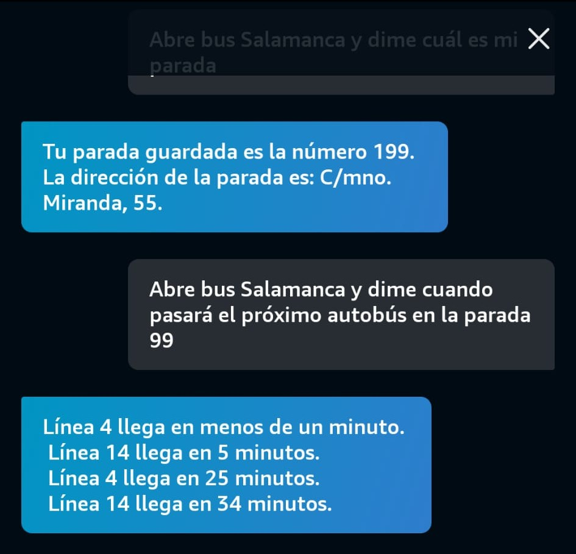
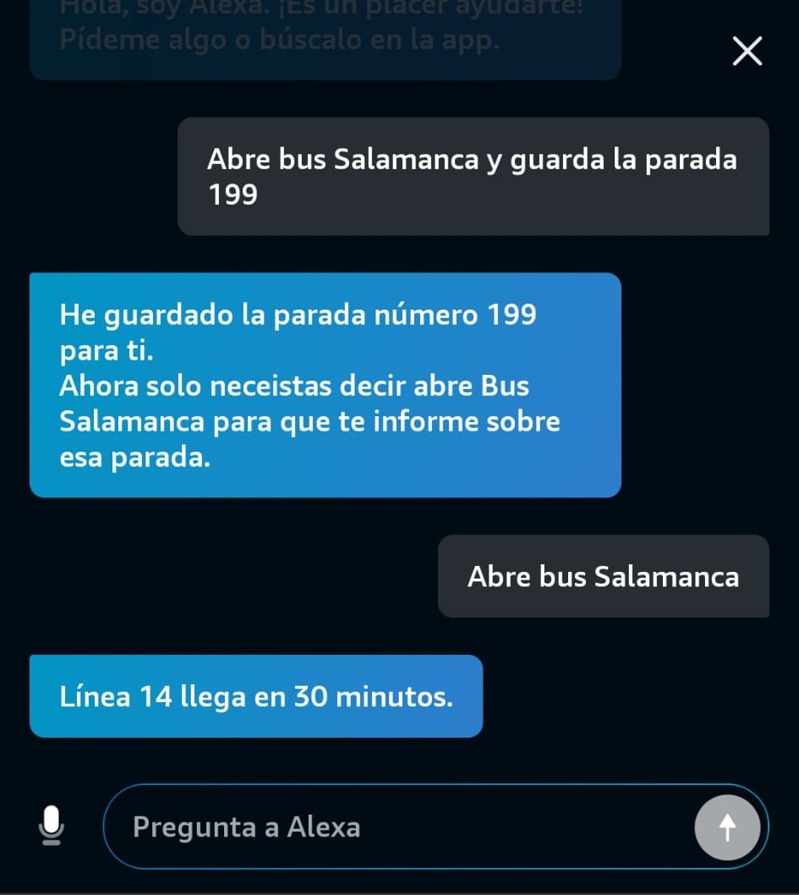
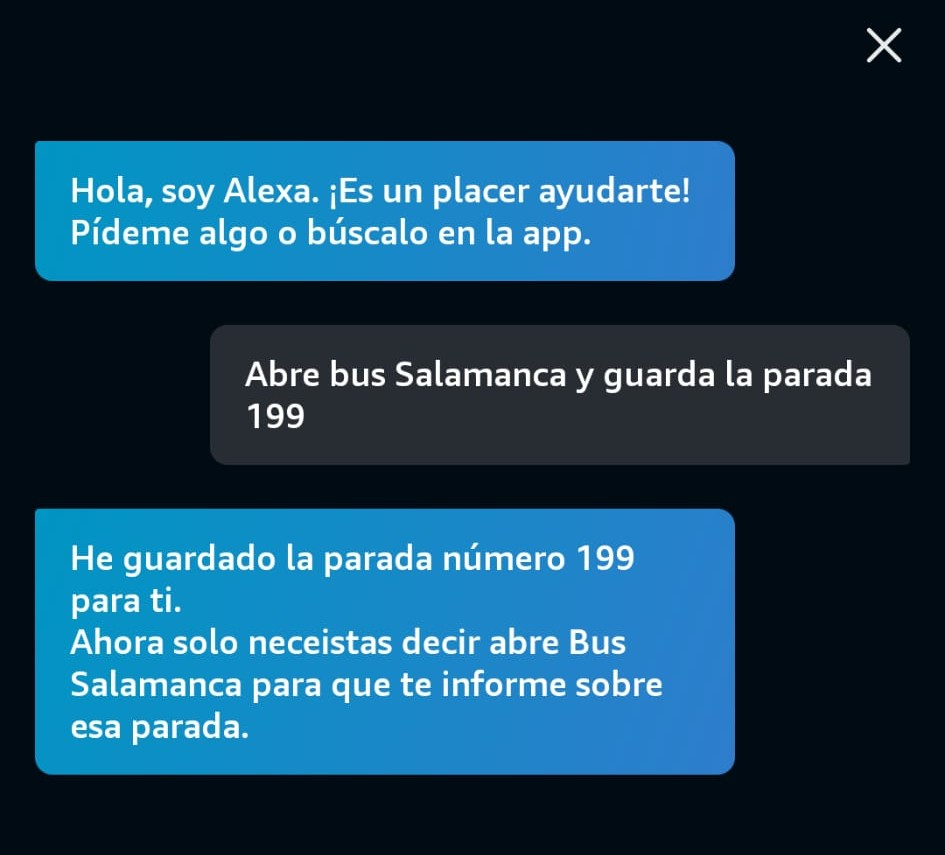
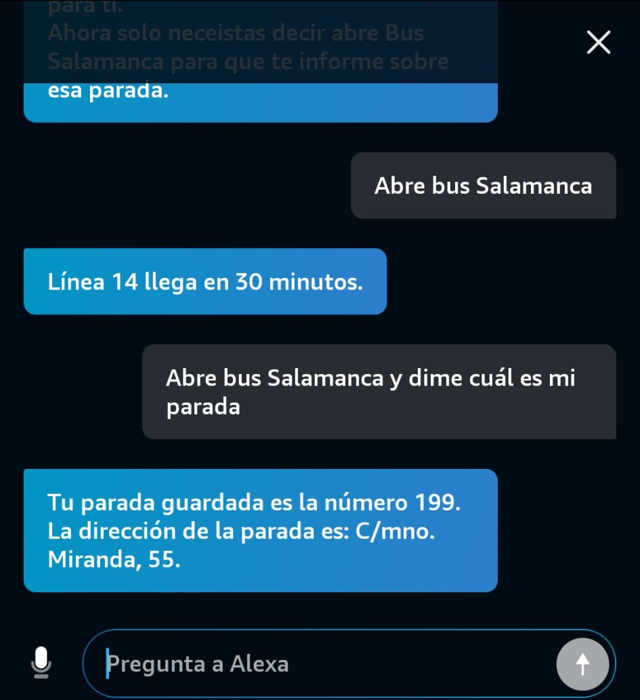
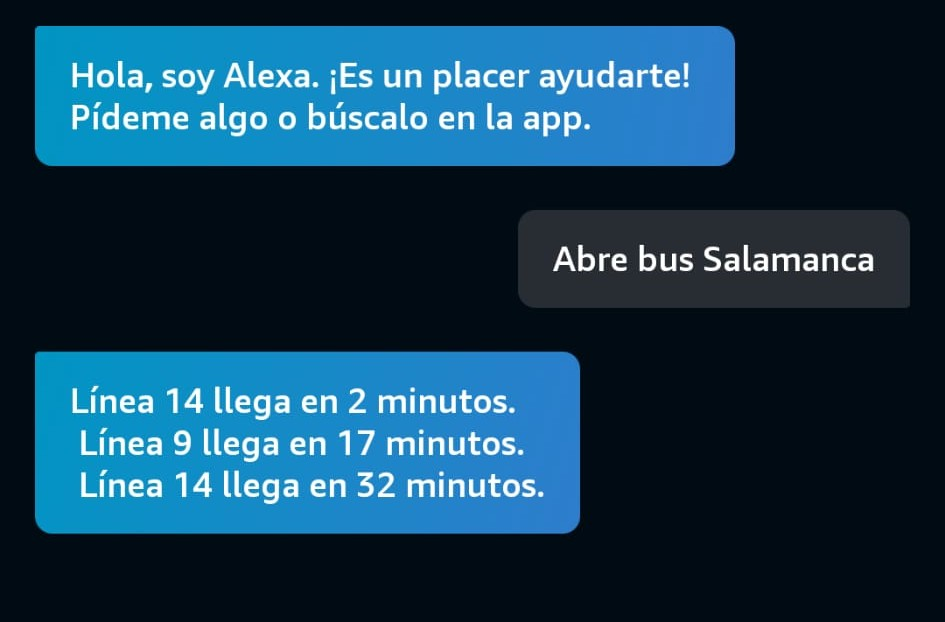
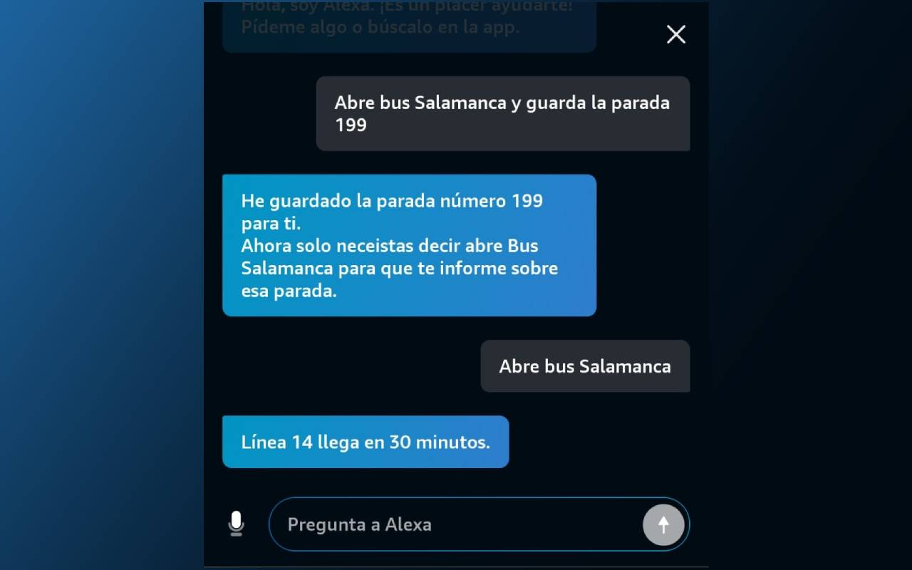
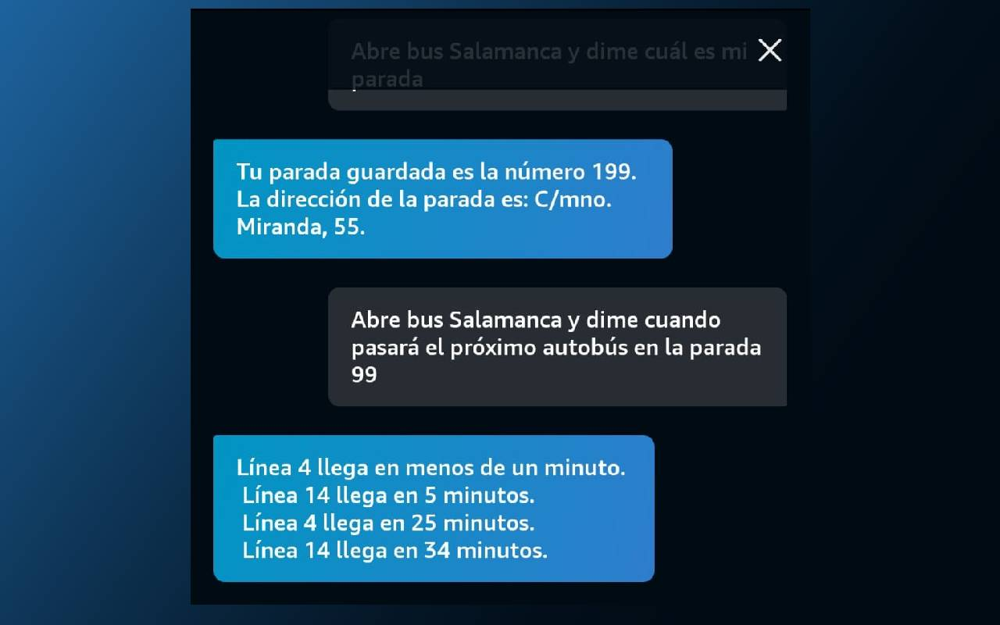

# Bus Salamanca — Alexa Skill + Web App

<br>

## 💖 Support this project
If you found this project helpful, please consider supporting it!

[](https://github.com/sponsors/JuanmanDev) [](https://ko-fi.com/juanmandev) [](https://paypal.me/juanmandev)

<br>

[](https://github.com/JuanmanDev/BusSalamancaAlexa/actions/workflows/docker-publish.yml)
[](https://github.com/JuanmanDev/BusSalamancaAlexa/actions/workflows/web-docker-publish.yml)
[](https://github.com/JuanmanDev/BusSalamancaAlexa/actions/workflows/release.yml)

Real-time bus arrival times for **Salamanca (Spain)**, available as:

| | |
|---|---|
| 🗣️ **Alexa skill** | [Bus Salamanca on amazon.es](https://www.amazon.es/dp/B0F59TDK93) — *"Alexa, abre Bus Salamanca"* |
| 🌐 **Web / PWA** | [bussalamanca.juanman.tech](https://bussalamanca.juanman.tech/) — live map, vehicles, routes, notifications, 13 languages |

Both use the public SIRI web service of *Salamanca de Transportes*.

## 🤖 Alexa+ compatibility

Alexa+ (the LLM-based Alexa) routes requests to skills differently: it reads the skill's
description/utterances, sends `CanFulfillIntentRequest`, fills slots with free text
("ciento noventa y nueve"), and sends built-in intents the old model never sent. The skill
has been updated for that — see **[ALEXA_PLUS.md](ALEXA_PLUS.md)** for the full list of
changes, the manual steps the skill owner still has to do in the developer console, and how
to deploy the updated manifest + interaction model from `skill-package/`.

## 🧱 Repository layout

```
src/                 Alexa skill backend (TypeScript, ask-sdk, Express, SQLite)
  handlers/          Intent handlers (incl. CanFulfillIntentRequest, Fallback, Repeat…)
  services/          BusService (SIRI SOAP client), StorageService (SQLite)
  utils/             APL documents, StopNumberParser (digits + Spanish/English words)
skill-package/       Alexa manifest (skill.json) + interaction model (es-ES.json)
openapi.yaml         REST API for Alexa+ Action SDK / agents (/api/action/…)
web/                 Nuxt 4 web app + PWA (Nuxt UI, MapLibre, Pinia, i18n, Umami)
siri/                SIRI experiments / test scripts
```

## 🏗️ Architecture

```
┌──────────────┐   ┌──────────────┐   ┌──────────────────────────────┐   ┌──────────────────┐
│ Alexa device │──▶│ Alexa Cloud  │──▶│ Docker: Express + ask-sdk    │──▶│ SIRI SOAP service│
│ / Alexa+     │◀──│ (LLM router) │◀──│ + SQLite (saved stops)       │◀──│ Salamanca de Tr. │
└──────────────┘   └──────────────┘   │ + REST /api/action (OpenAPI) │   └──────────────────┘
                                      └──────────────────────────────┘             ▲
┌──────────────┐   ┌──────────────────────────────────────────────┐                │
│ Browser/PWA  │──▶│ Docker: Nuxt 4 (SSR + Nitro API)             │────────────────┘
└──────────────┘   └──────────────────────────────────────────────┘
```

## 🚀 Skill backend (Docker)

```yaml
services:
  bus-salamanca:
    image: ghcr.io/juanmandev/bussalamancaalexa:latest
    ports:
      - "3000:3000"
    environment:
      - VERIFY_SIGNATURE=true
      - ALEXA_SKILL_ID=amzn1.ask.skill.xxxx   # optional but recommended
    volumes:
      - ./data:/data
```

Endpoints: `POST /` (Alexa), `GET /health`, `GET /openapi.yaml`, `GET /api/action/stop/:n`,
`GET|POST /api/action/user/:userId/stop`. Details in [DEPLOY.md](DEPLOY.md).

### Local development

```bash
npm install
VERIFY_SIGNATURE=false npm run dev   # tsx watch, port 3000
npm run test:local                    # 13 smoke requests (Launch, intents, CanFulfill, …)
npm run build                         # tsc → dist/
```

Environment variables: see [`.env.example`](.env.example).

## 🌐 Web app

```bash
cd web
npm install
npm run dev          # http://localhost:3000
npm run build        # .output/ (Node server)
```

Features: live map with vehicles (MapLibre + OpenFreeMap), stops & lines, arrivals with
ETAs, route planner, arrival notifications, offline PWA, dark mode, 13 locales, Umami
analytics. Built with Nuxt 4, Nuxt UI 4, Pinia, `@nuxtjs/i18n`, `@vite-pwa/nuxt`.

## 🔎 SEO

The web app ships: `<html lang/dir>` per locale, canonical + `hreflang` alternates (13 locales,
`x-default` → Spanish), Open Graph / Twitter cards (`/og-image.jpg`), JSON-LD (`WebSite`,
`WebApplication`, `BusStop` on stop pages), `robots.txt` and multi-locale sitemaps
(`/sitemap_index.xml`, ~390 URLs per locale incl. every stop and line) generated by
`@nuxtjs/sitemap` from `server/api/__sitemap__/urls.get.ts`. Private pages (settings,
notifications, route results) are `noindex`.

**Manual steps to actually appear on Google/Bing** (one-off):
1. [Google Search Console](https://search.google.com/search-console) → add property
   `https://bussalamanca.juanman.tech` → verify with the HTML-tag method: set
   `NUXT_PUBLIC_GSC_VERIFICATION=<token>` on the web container (or use DNS TXT).
2. Submit `https://bussalamanca.juanman.tech/sitemap_index.xml` in Search Console → Sitemaps,
   then *URL inspection → Request indexing* for `/`.
3. [Bing Webmaster Tools](https://www.bing.com/webmasters): import from Search Console, or set
   `NUXT_PUBLIC_BING_VERIFICATION=<token>`. Bing feeds DuckDuckGo/Ecosia.
4. Get a few inbound links (GitHub README ✔, juanman.tech, Salamanca forums/Reddit) — a brand-new
   domain with zero backlinks is the usual reason a site never shows up.

Env vars: `NUXT_SITE_URL` (default `https://bussalamanca.juanman.tech`), `NUXT_SITE_INDEXABLE=false`
for staging (emits `noindex` + blocking robots.txt).

## 🔄 CI/CD

* `docker-publish.yml` — builds & pushes the skill image to GHCR on every push to `main`.
* `web-docker-publish.yml` — same for the web app.
* `release.yml` — semantic-release (version bump, changelog, GitHub release).
* `deploy-lambda.disabled.yml` — legacy AWS Lambda deployment (kept for reference, disabled).

## 🧪 Testing

* Skill: `npm run test:local` against a locally running server (see above).
* Alexa simulator: *Developer Console → Test* (use `ask dialog` for multi-turn).
* SIRI raw data: `npm run test:siri`.

## ⚠️ Disclaimer

This project is **not affiliated** with *Salamanca de Transportes* or the City Council of
Salamanca. It is an independent, open-source project that uses publicly available data.
Arrival times are estimations provided by the operator's public service.

## 🔒 Privacidad

La skill solo guarda el número de parada elegido asociado al identificador anónimo de
usuario que proporciona Alexa. No se recogen ni comparten datos personales.

## 📄 License

MIT.

## 📷 Screenshots












<br>

## 💖 Support this project
If you found this project helpful, please consider supporting it!

[](https://github.com/sponsors/JuanmanDev) [](https://ko-fi.com/juanmandev) [](https://paypal.me/juanmandev)

<br>
